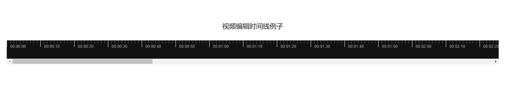

<h1 align="center">
 video-editing-timeline-vue
</h1>

</img>

## install

```
// npm
npm install video-editing-timeline-vue --save

// yarn
yarn add video-editing-timeline-vue
```

## usage

// Global registry

```
import Vue from 'vue';
import VideoEditingTimeline from 'video-editing-timeline-vue';

Vue.use(VideoEditingTimeline);

<template>
  <VideoEditingTimeline :config="config" />
</template>

<script>

export default {
  data() {
    return {
       config: {
            canvasWidth: 5000,
            canvasHeight: 50,
            minimumScale: 10, // 一个小刻度长度(单位px)
            minimumScaleTime: 1, // 一个小刻度代表时间（单位秒）
       }
    };
  }
};
</script>
```

// Component registry

```
<template>
  <VideoEditingTimeline  :config="config" />
</template>

<script>
import VideoEditingTimeline from 'video-editing-timeline-vue';
export default {
  components: {
    VideoEditingTimeline
  },
  data() {
    return {
     config: {
        canvasWidth: 5000,
        canvasHeight: 50,
        minimumScale: 10, // 一个小刻度长度(单位px)
        minimumScaleTime: 1, // 一个小刻度代表时间（单位秒）
     }
    };
  }
};
</script>

```
